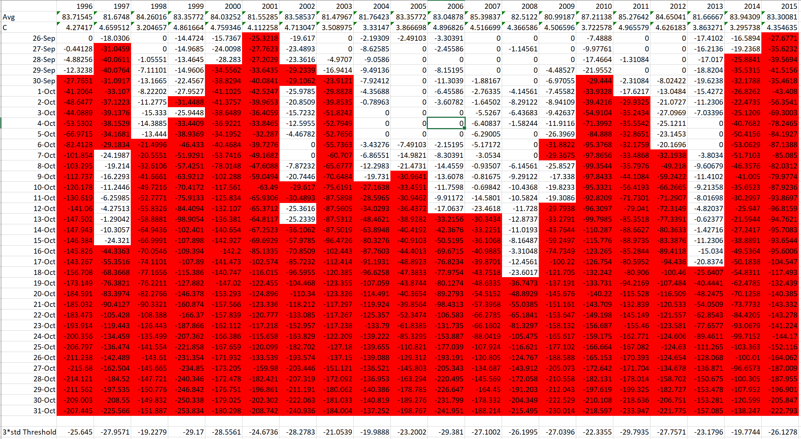
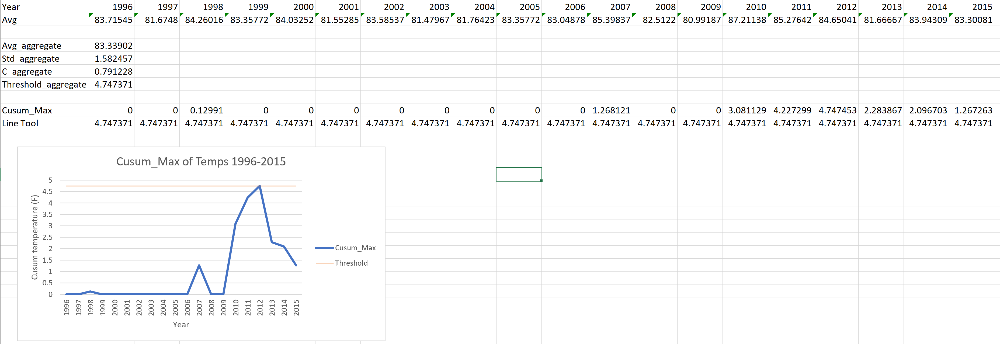
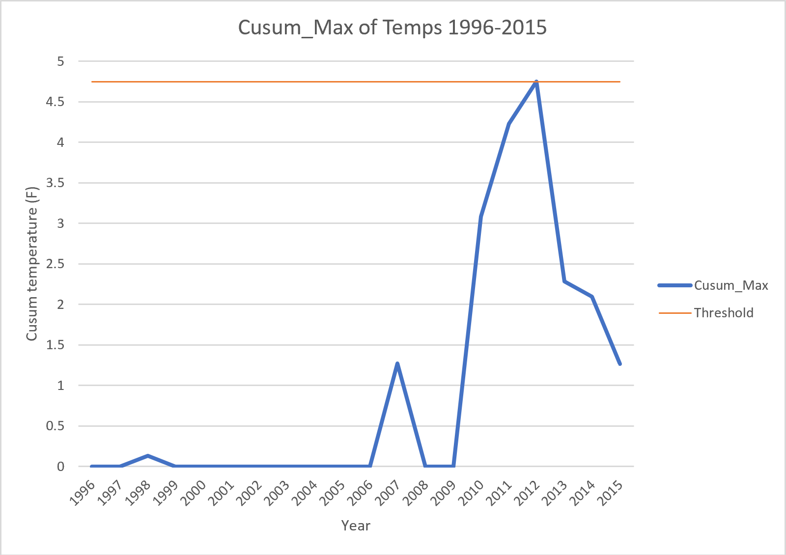

```{r setup, include=FALSE}
knitr::opts_chunk$set(echo = TRUE)
```

## Question 5.1
```{r}
library(outliers)
#setwd("/Users/alan/Dropbox (GaTech)/Fall19/6501/6501-hw/hw3")
data_df = read.table("uscrime.txt", header = TRUE)
grubbs.test(data_df$Crime, type=11, opposite=FALSE, two.sided=TRUE)
```
Upon running the two-sided grubbs test, the output notes that there are outliers at both ends with a low p-value, suggesting that both values 342 and 1993 are indeed outliers. However, upon running the one-sided grubbs test (shown below), the results seem to call this conclusion into question --
```{r}
grubbs.test(data_df$Crime, type=10, opposite=FALSE, two.sided=FALSE)
grubbs.test(data_df$Crime, type=10, opposite=TRUE, two.sided=FALSE)
```
Looking at the one-sided grubbs test for outliers, we find that the p-value for the low end outlier (342) is 1, so this outlier can't be considered with confidence. The p-value for the upper end outlier (1993) is 0.07887, so we can consider this a true outlier in the crime dataset.

```{r}
ineq_vec = data_df$Ineq
ineq_med = median(ineq_vec)
ineq_low = subset(data_df,Ineq<ineq_med)
ineq_high = subset(data_df,Ineq>=ineq_med)
boxplot(data_df$Crime,ineq_low$Crime,ineq_high$Crime)
```
Boxplot 1 - Full Dataset
Boxplot 2 - Lower Income Inequality
Boxplot 3 - Higher Income Inequality

Above we partitioned the data into high and low income inequality subsets in order to observe discrepancies between the groups, noting that different partitions (i.e. on population or region) would yield different results where outlier points in one partition may not be represented as outliers in other partitions.


## Question 6.1
*Describe a situation or problem from your job, everyday life, current events, etc., for which a Change Detection model would be appropriate. Applying the CUSUM technique, how would you choose the critical value and the threshold?*


A change detection model would be appropriate for the assessing whether an NFL player has a concussion. Often times concussions are only detected after a player has been involved in a jarring hit or has extremely noticeable symptoms. Diagnosing and treating concussions is the cornerstone of NFL player preventative and rehabilitative care and NFL training staff members could improve their care by using a change detection model.  

Weekly or monthly data could be collected from players on information retention and/or reaction speed. Applying a CUSUM technique could tell training staff whether a player has a concussion by analytically determining cumulative drops in reaction/recall. Critical values would have to be appropriately set in order to reduce the risk of false positives. Naturally peoples IQ’s, recall, and reaction change day to day for various reasons (sleep, nutrition, etc….). An initial critical value (C value) could be 1 standard deviation away. An initial threshold value could be 3 standard deviations away. Of course the NFL should consult concussion experts and neurologists on the validity of these numbers. 

## Question 6.2
### 1


For each year, we used a min cumsum function defined by: $$S_{t}=Min(0, S_{t-1} + (X_i - \mu + C))$$


This function was applied with a C $0.5 * std(temperature)$ and a threshold value of $3 * std(temperature)$ on a year to year basis.  The values of .5 and 3 come from this [article](https://www.spcforexcel.com/knowledge/variable-control-charts/keeping-process-target-cusum-charts) on statistical process control. Visually, we used conditional formatting in excel to find the date where the cumulative sum of the temparature dropped below our Threshold value. Inspection of the data revealed that in the years 2000 and 2013, there were instances of false positives where the cumsum dropped below the threshold but only for one day. We interpreted this to represent a temporary cold snap but not the end of summer. We interpreted yearly cooling off periods based on the first date at which a consistent, subsequent period of the cumsum was below the threshold value. 

1996: September 30th
1997: September 27th
1998: October 6th
1999: October 2nd
2000: September 29th
2001: September 26th
2002: October 10th
2003: September 30th
2004: October 10th
2005: October 9th
2006: October 13th
2007: October 13th
2008: October 19th
2009: October 6th
2010: September 30th
2011: October 2nd
2012: October 7th
2013: October 18th
2014: September 28th
2015: September 26th

### 2



We started by taking the yearly average temperature over the entire dataset. We calculated the standard deviation in order to find C and Threshold values using the same 0.5 and 3 coefficients from part 1. We used a max cumsum function to determine whether the temperatures had consistently risen over time. The cumsum of temperatures did exceed the threshold in 2012, indicating that temperatures have been rising over time.




